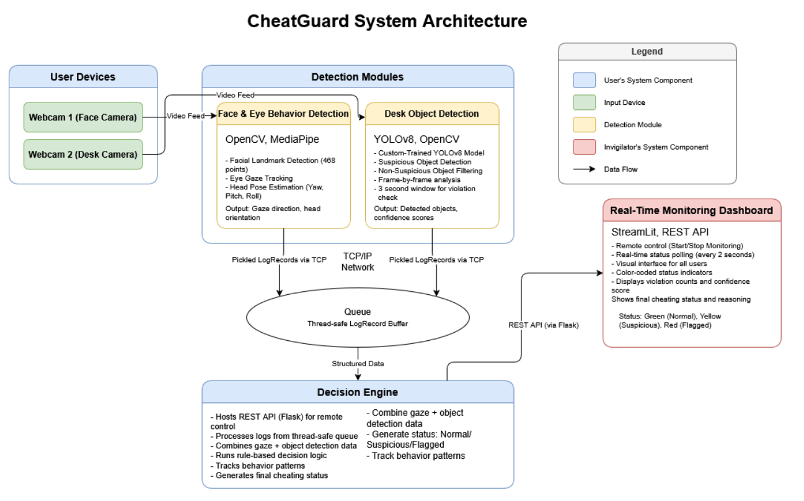

# 🛡️ CheatGuard

An intelligent AI-powered proctoring system that uses computer vision and machine learning to detect suspicious behavior during online examinations.


## 🎯 Overview

CheatGuard is a comprehensive exam proctoring solution that combines real-time face tracking and object detection to monitor students during online exams. The system runs on the student's machine and can be remotely controlled by a proctor through a web-based dashboard.

### Key Capabilities

- **Real-time Face & Gaze Tracking**: Monitors student's attention and detects looking away
- **Prohibited Object Detection**: Identifies phones, cheat sheets, and earbuds using YOLO
- **Remote Monitoring**: Proctor can control and monitor from a separate machine
- **Intelligent Decision Engine**: AI-based cheating detection with confidence scoring
- **Dual Camera Support**: Face camera + desk camera for comprehensive monitoring
- **Automated Logging**: CSV and JSON logs for post-exam review

## ✨ Features

### Face Tracking Module
- MediaPipe-based facial landmark detection
- Head pose estimation (yaw, pitch, roll)
- Gaze direction tracking (left, right, up, down)
- Eye aspect ratio calculation
- Configurable violation thresholds
- Real-time flagging system

### Object Detection Module
- YOLOv8-based custom model trained on prohibited items
- Detects: Phones, Cheat sheets (chits), Earbuds
- Continuous detection with 5-second confirmation window
- Low latency inference (~600-700ms)
- GPU acceleration support
- Confidence threshold: 30%

### Decision Engine
- Multi-factor cheating detection algorithm
- Confidence-based scoring system (0-100%)
- Time-windowed violation tracking (5-minute window)
- Combines face and object violations
- Threshold: 70% confidence to flag cheating
- Real-time status updates

### Remote Dashboard
- Streamlit-based web interface
- Real-time monitoring from proctor's PC
- Remote start/stop controls
- Live violation alerts
- Event timeline
- System health monitoring

## 🏗️ System Architecture



### Components

1. **Student Machine**
   - `main.py`: Face tracking module
   - `yolo_detection.py`: Object detection module
   - `server_agent.py`: Flask API server & decision engine

2. **Proctor Machine**
   - `proctor_dashboard.py`: Remote monitoring dashboard

3. **Communication**
   - REST API (Port 5000): Control commands
   - Socket logging (Ports 9020, 9021): Real-time log streaming

## 🛠️ Technologies Used

### Core Technologies
- **Python 3.8+**: Primary programming language
- **OpenCV**: Video capture and image processing
- **MediaPipe**: Face mesh and landmark detection
- **YOLOv8 (Ultralytics)**: Object detection
- **PyTorch**: Deep learning framework
- **Flask**: REST API server
- **Streamlit**: Dashboard interface

### Additional Libraries
- **NumPy**: Numerical computing
- **Pandas**: Data manipulation
- **Requests**: HTTP client
- **Socket Programming**: Real-time log streaming

## 📦 Installation

### Prerequisites

```bash
# Python 3.8 or higher
python --version

# CUDA-capable GPU (optional, for faster inference)
nvidia-smi
```

### Step 1: Clone the Repository

```bash
git clone https://github.com/aryanmishra333/CheatGuard.git
cd CheatGuard
```

### Step 2: Install Dependencies

```bash
pip install -r requirements.txt
```

### Step 3: Download YOLO Model

Place the custom YOLO model file `644_img.pt` in the project root directory.

### Step 4: Camera Setup

**Option 1: CAMO Studio (Recommended)**
- Install CAMO Studio on your computer
- Connect your phone via USB
- CAMO will make your phone appear as Camera 1

**Option 2: IP Webcam**
- Install IP Webcam app on Android
- Configure IP address in `config.py`

## ⚙️ Configuration

Edit `config.py` to customize settings:

```python
# Camera Configuration
FACE_CAMERA_SOURCE = 0  # Built-in webcam for face tracking
OBJECT_DETECTION_CAMERA_SOURCE = 1  # Phone/external camera for desk

# Detection Thresholds
YOLO_CONFIDENCE_THRESHOLD = 0.3  # 30%
OBJECT_VIOLATION_DURATION = 5.0  # seconds

# Prohibited Objects
PROHIBITED_OBJECTS = ['Chit', 'Phone', 'Earbuds']

# Decision Engine
CONFIDENCE_THRESHOLD = 0.7  # 70% confidence to flag cheating
TIME_WINDOW = 300  # 5 minutes

# Logging
LOG_FOLDER = "logs"
```

## 🚀 Usage

### Student Machine Setup

1. **Start the Server Agent**

```bash
python server_agent.py
```

Note the displayed IP address (e.g., `192.168.1.100`)

2. **Verify Cameras**

Test face camera:
```bash
python test_camo_camera.py
```

Test object detection camera:
```bash
python test_ip_webcam.py
```

### Proctor Machine Setup

1. **Launch the Dashboard**

```bash
streamlit run proctor_dashboard.py
```

2. **Connect to Student PC**
   - Enter the student's IP address in the sidebar
   - Click "Connect"
   - Click "START MONITORING"

3. **Monitor in Real-Time**
   - View live violation alerts
   - Check detection module status
   - Review event timeline
   - Stop monitoring when exam ends

### Standalone Testing

**Face Tracking Only:**
```bash
python main.py
```

**Object Detection Only:**
```bash
python yolo_detection.py
```

**YOLO Custom Testing:**
```bash
cd yolo_custom
python yolo_custom.py
```

## 📁 Project Structure

```
CheatGuard/
├── main.py                      # Face tracking module
├── yolo_detection.py            # Object detection module
├── server_agent.py              # Server agent & decision engine
├── proctor_dashboard.py         # Remote monitoring dashboard
├── config.py                    # Configuration settings
├── AngleBuffer.py               # Head pose smoothing
├── calibration_test.py          # Camera calibration utility
├── requirements.txt             # Python dependencies
├── 644_img.pt                   # YOLO model weights
│
├── yolo_custom/                 # YOLO testing scripts
│   ├── yolo_custom.py
│   └── 644_img.pt
│
├── logs/                        # Detection logs (CSV/JSON)
│   ├── eye_tracking_log_*.csv
│   ├── object_detection_log_*.csv
│   └── eye_tracking_logs_*.json
│
└── runs/                        # YOLO inference results
    └── detect/
```

## 🔍 Detection Modules

### Face Tracking Module (`main.py`)

**How It Works:**
1. Captures video from face camera (Camera 0)
2. Detects 468 facial landmarks using MediaPipe
3. Calculates head pose (yaw, pitch, roll)
4. Determines gaze direction
5. Flags violations when looking away
6. Sends logs to server agent via socket (Port 9020)

**Violation Criteria:**
- Looking left/right for extended periods
- Looking up/down repeatedly
- Configurable angle thresholds

### Object Detection Module (`yolo_detection.py`)

**How It Works:**
1. Captures video from desk camera (Camera 1)
2. Runs YOLO inference on each frame
3. Identifies prohibited objects
4. Tracks detection duration
5. Triggers violation after 5 seconds of continuous detection
6. Sends logs to server agent via socket (Port 9021)

**Detected Objects:**
- **Chit**: Paper notes, cheat sheets
- **Phone**: Mobile phones, smartphones
- **Earbuds**: Wireless earphones, headphones

### Decision Engine (`server_agent.py`)

**Algorithm:**
```
IF recent_face_violations >= 3:
    confidence += 40%
    
IF recent_object_violations >= 1:
    confidence += 70%
    
IF total_violations >= 5:
    confidence += 30%
    
IF confidence >= 70%:
    FLAG AS CHEATING
```

**Features:**
- 5-minute rolling time window
- Weighted confidence scoring
- Multi-factor violation analysis
- Real-time status updates

## 📊 Dashboard

The Streamlit dashboard provides:

### System Status
- Overall status: Running / Idle / Partial
- Module health: Face tracking, Object detection
- Connection status

### Cheating Detection
- Real-time cheating alerts (🚨)
- Confidence percentage
- Detailed violation reasons

### Metrics
- Total violations count
- Face violations
- Object violations
- Active modules

### Live Data
- Gaze direction
- Head pose angles
- Detected objects
- Prohibited items

### Event Log
- Timestamped events
- Severity indicators
- Violation history

## 📝 Logging

### Face Tracking Logs
**Location:** `logs/eye_tracking_log_*.csv`

**Contains:**
- Timestamp
- Gaze direction
- Head pose angles
- Eye aspect ratio
- Violation flags

### Object Detection Logs
**Location:** `logs/object_detection_log_*.csv`

**Contains:**
- Timestamp
- Detected objects
- Prohibited objects
- Violation duration
- Inference time

### JSON Logs
**Location:** `logs/eye_tracking_logs_*.json`

Structured logs for programmatic analysis.

## 🔧 Troubleshooting

### Camera Not Detected

```bash
# Check available cameras
python -c "import cv2; print([cv2.VideoCapture(i).isOpened() for i in range(5)])"
```

### YOLO Model Not Found

```bash
# Verify model path
ls -l 644_img.pt
```

### Connection Issues

- Ensure both PCs are on the same network
- Check firewall settings (allow port 5000)
- Verify IP address is correct
- Test with: `curl http://<IP>:5000/api/info`

### Module Not Starting

- Check logs in console output
- Verify camera permissions
- Ensure dependencies are installed
- Try running modules individually

### Low Detection Accuracy

- Adjust `CONFIDENCE_THRESHOLD` in config
- Ensure proper lighting
- Check camera positioning
- Calibrate cameras using `calibration_test.py`

## 🤝 Contributing

Contributions are welcome! Please follow these steps:

1. Fork the repository
2. Create a feature branch (`git checkout -b feature/AmazingFeature`)
3. Commit your changes (`git commit -m 'Add some AmazingFeature'`)
4. Push to the branch (`git push origin feature/AmazingFeature`)
5. Open a Pull Request

## 📄 License

This project is licensed under the MIT License - see the LICENSE file for details.

## 👥 Authors

- **Aryan Mishra** - [@aryanmishra333](https://github.com/aryanmishra333)

## 🙏 Acknowledgments

- MediaPipe team for facial landmark detection
- Ultralytics for YOLOv8 framework
- Streamlit for dashboard framework
- OpenCV community

## 📧 Contact

For questions or support, please open an issue on GitHub or contact [your-email@example.com]

---

**⚠️ Disclaimer:** This software is intended for educational purposes and legitimate proctoring scenarios. Users must comply with privacy laws and obtain proper consent before monitoring individuals.